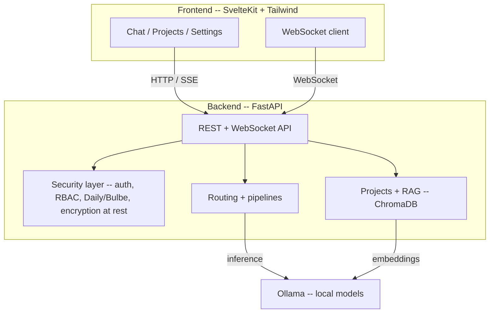

# Opti-Oignon


A local-first AI inference platform for [Ollama](https://ollama.com). Private chat against your own local models, projects with RAG context, and a defense-in-depth security model -- two security modes (Daily/Bulbe), encryption at rest, and 2FA -- all running on your own hardware, with nothing leaving the machine. Built with SvelteKit and FastAPI.

The project is open source, and its security follows Kerckhoffs's principle: it derives from keys and correct implementation, never from secrecy of the code.

## Status

Opti-Oignon is in active development. The list below is an honest picture of what is wired end to end today versus what exists in the codebase but is still maturing -- read it before you rely on a feature.

**Working today** (used daily on the developer's machine):

- Streamed chat from local Ollama models over WebSocket.
- Accounts: registration, login, and optional 2FA (TOTP and WebAuthn).
- Two security modes. Daily is the normal mode; Bulbe is a hardened mode enforced at the socket layer (the backend binds to `127.0.0.1` only and accepts cookie-based auth only), with a guarded, human-confirmed downgrade ceremony and fail-secure behavior when the mode cannot be determined.
- Encryption at rest via SQLCipher.
- Projects with RAG context (ChromaDB).

**Implemented and unit-tested, still maturing**: the wider intelligence surface (smart routing, multi-model consensus, cascading inference, semantic cache), the sandboxed agent loop, the benchmark and performance dashboards, the resource governor, the red team engine, RBAC and multi-user isolation, and the encrypted Notes tab. The code is present and covered by the test suite, but a fresh install is not guaranteed to exercise every one of these paths end to end yet.

**In progress, not wired end to end**: Veilid device-to-device sync. The producer side is not complete, so nothing currently moves between paired devices. Everything that depends on it -- remote inference, collaborative Notes sync, and the mobile client -- is therefore experimental.

## Quick start

Prerequisites: Python 3.10 or newer (developed on 3.12 and 3.13), Node.js 18 or newer, and a running Ollama with at least one model pulled.

```bash
git clone https://github.com/AntsAreRad/opti-oignon.git
cd opti-oignon

# Backend: core deps plus 2FA and encrypted-database support
pip install -e ".[auth,sqlcipher]"

# Frontend
cd frontend && npm install && cd ..
```

Then run the two dev servers in separate terminals:

```bash
# Terminal 1 -- backend on http://127.0.0.1:8001
scripts/dev_backend.sh --reload

# Terminal 2 -- frontend on http://localhost:5173 (proxies /api to the backend)
scripts/dev_frontend.sh
```

Open http://localhost:5173, create an account, and start chatting. The first run shows an onboarding overlay that scans your Ollama models and suggests a preset.

Optional capabilities install through their own extras and are off by default: `llama` (llama.cpp backend), `veilid` (peer-to-peer sync), `transcribe` (voice-note transcription), and `vision` (image OCR for notes). For example, `pip install -e ".[veilid]"`. These are kept out of the core install because they are platform-specific or experimental.

### Docker

```bash
# Backend on 127.0.0.1:8001 plus a GPU-enabled Ollama
docker compose up --build
```

The Compose stack ships the backend and Ollama; the frontend container is disabled by default, so run the frontend with `scripts/dev_frontend.sh` pointed at the Dockerized backend. All ports bind to `127.0.0.1`. GPU passthrough requires the [NVIDIA Container Toolkit](https://docs.nvidia.com/datacenter/cloud-native/container-toolkit/install-guide.html); without it, Ollama runs on CPU.

## Security model

Security is the project's first design priority. The core posture, as wired today:

- **Two modes.** Daily is the normal working mode. Bulbe is a physical network constraint, not a policy: the server binds to `127.0.0.1` at the socket level and accepts cookie-only authentication, so even a misconfiguration cannot expose it on the network. Switching from Bulbe back to Daily runs a guarded, human-confirmed downgrade ceremony, and an undeterminable mode fails secure (stays Bulbe).
- **Encryption at rest.** Application data lives in SQLCipher-encrypted databases.
- **Authentication.** Deny-by-default middleware, password hashing with Argon2/bcrypt, and optional 2FA via TOTP and WebAuthn.
- **Isolation.** Per-user data isolation and role-based access control.
- **Sandboxing.** Any LLM-driven filesystem, shell, or code tool is designed to run only inside a disposable bubblewrap sandbox with no host filesystem or network access; results are copied out only after explicit human approval.
- **Post-quantum signatures.** Records intended for device-to-device sync carry ML-DSA-65 signatures (note: the sync transport itself is still in progress -- see Status).
- **Signed audit chain.** Security-relevant events append to a hash-chained audit log.

See [SECURITY.md](SECURITY.md) for the threat model and how to report a vulnerability.

## Architecture



The diagram shows the core request path. The broader surface (sandboxed agent, benchmark, resource governor, red team engine, device sync) sits behind the same API and backend; consult the Status section for how mature each part is.

## What's included

The core, working today, is private local chat with accounts and the two-mode security model described above, plus projects with RAG context. Beyond that, the codebase also implements -- at varying maturity (see Status) -- intelligent model routing with capability profiles and health-aware failover, multiple inference pipelines (chain-of-thought, multi-model consensus, self-correction, speculative and cascading inference), a semantic response cache, dynamic context budgeting and conversation compression, a sandboxed autonomous coding agent, a benchmark and performance dashboard, a resource governor that fits context to available VRAM, an LLM-powered red team engine, an encrypted Notes tab, and a Veilid-based device-to-device sync layer.

## Project structure

```
frontend/            SvelteKit + Tailwind UI (components, typed API clients, stores, routes)
opti_oignon/         FastAPI backend
  api/               Route modules and the FastAPI application (app.py, deps.py, schemas.py)
  config/            YAML configuration files
  redteam/           LLM-powered red team engine
  veilid/            Device-to-device sync (experimental)
  notes/             Encrypted Notes feature
data/                System presets and seed data
tests/               Unit and integration test suite
tests/e2e/           Playwright end-to-end specs
scripts/             dev_backend.sh, dev_frontend.sh, run_tests.sh, run_coverage.sh,
                     run_e2e.sh, run_typecheck.sh, smoke_test.sh, sign_release.sh, ...
docs/                API reference and guides
```

## Configuration

All tunable behavior lives in `opti_oignon/config/` as YAML files (model-to-task mapping, routing weights, reasoning and consensus thresholds, cache settings, sandbox blocklists, and so on). System presets in `data/system_presets.yaml` can configure most of them at once, and the first-run onboarding applies a preset based on your installed models.

## API

The backend exposes a REST and WebSocket API covering health, chat and conversations, models and routing, projects and RAG, security and audit, and more. Interactive OpenAPI docs are served at http://localhost:8001/docs while the backend is running. See [docs/API_REFERENCE.md](docs/API_REFERENCE.md) for endpoint documentation.

## Testing

```bash
# Unit and integration tests
pytest tests/ --ignore=tests/test_live_v130.py -q

# With coverage gates
bash scripts/run_coverage.sh

# API smoke test (starts a throwaway backend)
bash scripts/smoke_test.sh

# Type checking against the mypy baseline
bash scripts/run_typecheck.sh

# Frontend end-to-end tests (Playwright, mocked backend)
bash scripts/run_e2e.sh
```

The suite covers the backend modules and a set of Playwright scenarios (auth, chat, settings, RAG, security panel, and mobile-viewport variants). Security-critical modules have individual minimum coverage thresholds; see `.coveragerc` and `coverage_baseline.json`.

## Development

Conventions enforced across the codebase:

- English comments, docstrings, and UI text throughout; no emojis in code.
- All CSS uses `--oo-*` custom properties exclusively, never hardcoded colors.
- Conditional imports guarded by `FEATURE_AVAILABLE` flags, with graceful fallbacks.
- YAML-driven configuration for tunable values.
- Separate SQLite databases per feature domain, all opened through a single safe-connect helper.
- Type annotations on public API functions, checked against a mypy baseline.
- A test suite per change, with a zero-regressions policy.

See [CONTRIBUTING.md](CONTRIBUTING.md) for the full guidelines.

## Roadmap

The near-term focus is finishing the Veilid sync layer so device-to-device sync moves real data end to end, which in turn unblocks remote inference, collaborative Notes sync, and the mobile client. Alongside that: hardening the supply chain (code signing, runtime guards, audit-chain external anchoring) and exercising the broader feature surface end to end on fresh installs.

## Contributing

1. Fork the repository.
2. Create a feature branch.
3. Follow the coding conventions above and in [CONTRIBUTING.md](CONTRIBUTING.md).
4. Add tests for new functionality.
5. Run `pytest tests/ --ignore=tests/test_live_v130.py` and `bash scripts/run_typecheck.sh`.
6. Open a pull request.

## License

MIT License -- see [LICENSE](LICENSE).

## Acknowledgments

Built with [Ollama](https://ollama.com), [FastAPI](https://fastapi.tiangolo.com), [SvelteKit](https://kit.svelte.dev), and [ChromaDB](https://www.trychroma.com).
