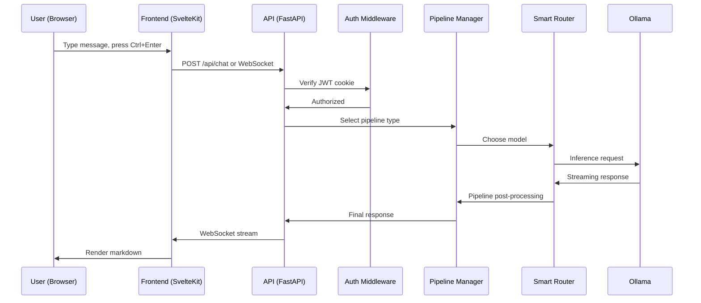
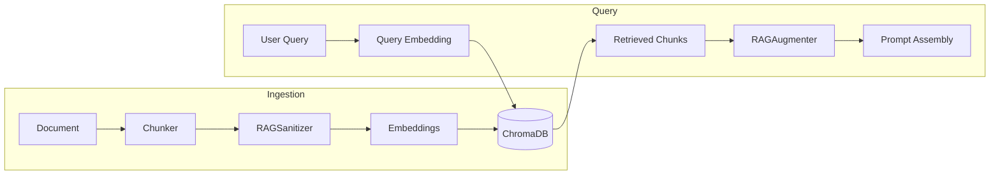
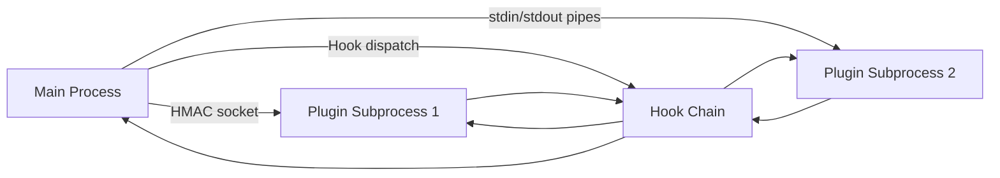
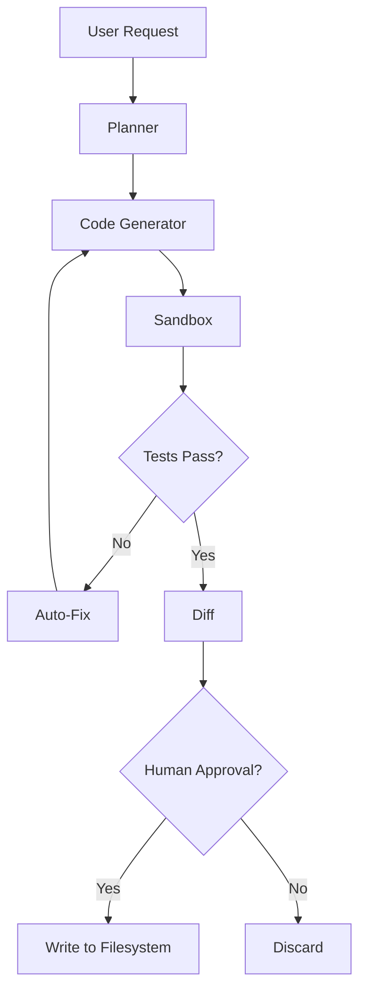

# Data Flow

## Request lifecycle

A typical chat request flows through these stages:

## Pipeline selection

The pipeline manager analyzes each query to select the appropriate
pipeline:

1. **Query analysis** -- classify the query (code, reasoning, factual,
   creative, etc.)
2. **Pipeline matching** -- select from 9 pipeline types based on query
   type and configuration
3. **Model selection** -- smart router picks the best model considering
   capability profiles, context window, and health
4. **Execution** -- run the pipeline with the selected model
5. **Post-processing** -- plugin hooks, response formatting

## RAG data flow

During ingestion, documents are chunked, sanitized (injection markers
stripped), embedded via Ollama, and stored in ChromaDB. Parallel
ingestion uses a thread pool for concurrent processing.

During query, the user's question is embedded, similar chunks are
retrieved, sanitized again by the augmenter, and injected into the
prompt before inference.

## Plugin data flow

Plugins run in subprocesses and communicate via IPC:

Hook data flows through a chain: each plugin receives the output of
the previous one. Errors are isolated -- a failing plugin does not
break the chain.

## Coding agent data flow

The coding agent operates entirely within the sandbox until the apply
phase. Working memory persists context across steps. Cascading
auto-escalates to larger models on repeated failures.

## Data storage

| Data | Storage | Encryption |
|------|---------|------------|
| Conversations | SQLite (per-user) | SQLCipher when available |
| User accounts | SQLite | bcrypt passwords, SQLCipher DB |
| RAG vectors | ChromaDB | Collection-level isolation |
| RAG metadata | SQLite | SQLCipher when available |
| Audit chain | SQLite | SQLCipher + ML-DSA-65 signatures |
| Plugin config | SQLite | Per-user, SQLCipher |
| Benchmarks | SQLite | SQLCipher when available |
| Configuration | YAML files | Filesystem permissions |

All databases use WAL mode for concurrent read performance and are
accessed through module-level singletons with `reset_*()` functions
for test isolation.
