# Security Layers

## Layer model

Opti-Oignon's security is built as six independent layers. Each layer
defends against a different class of threat, and each operates
independently so that compromising one does not bypass the others.

```mermaid
flowchart TD
    subgraph L1["Layer 1: Auth + RBAC"]
        A1[Deny-by-default middleware]
        A2[JWT session cookies]
        A3[WebAuthn / TOTP 2FA]
        A4[Per-user data isolation]
    end

    subgraph L2["Layer 2: Encryption"]
        B1[AES-256-GCM field encryption]
        B2[SQLCipher database encryption]
        B3[SecureBytes mlock key storage]
        B4[Argon2id key derivation]
    end

    subgraph L3["Layer 3: Sandbox"]
        C1[bwrap kernel namespaces]
        C2[Command validator + blocklists]
        C3[Tempdir network isolation fallback]
        C4[Plugin subprocess isolation]
    end

    subgraph L4["Layer 4: Network"]
        D1[Bulbe mode localhost binding]
        D2[Ollama bind guard]
        D3[CSP headers]
        D4[CSRF middleware]
    end

    subgraph L5["Layer 5: Audit"]
        E1[Hash-chain audit log]
        E2[ML-DSA-65 post-quantum signatures]
        E3[External anchor export]
        E4[Tamper detection]
    end

    subgraph L6["Layer 6: Testing"]
        F1[Red team engine]
        F2[Dependency monitoring]
        F3[Automated scheduling]
        F4[Regression detection]
    end

    L1 --> L2 --> L3 --> L4 --> L5 --> L6
```

## Layer 1: Authentication and authorization

The auth middleware intercepts every request and denies by default.
Only explicitly public endpoints bypass authentication.

- **JWT cookies** with Secure, HttpOnly, SameSite=Strict flags
- **Session fingerprinting** binds sessions to client characteristics
- **RBAC** enforces per-user data isolation at the database level
- **2FA** via WebAuthn/FIDO2 (hardware keys) and TOTP (authenticator
  apps)

Threat model: unauthorized access, session hijacking, privilege
escalation.

## Layer 2: Encryption at rest

All sensitive data is encrypted before storage.

- **SQLCipher** provides transparent database encryption
- **AES-256-GCM** provides authenticated field-level encryption
- **SecureBytes** uses mlock to prevent key material from being
  swapped to disk
- **Argon2id** derives encryption keys from passwords with memory-hard
  parameters

Threat model: physical disk theft, backup exposure, memory dumping.

## Layer 3: Sandbox isolation

LLM-driven tools and plugins operate in restricted environments.

- **bwrap** provides kernel-level namespace isolation (network
  disabled, PID isolated, filesystem read-only)
- **Command validator** blocks dangerous patterns (base64-pipe-to-shell,
  write-then-execute, forbidden directories)
- **Tempdir fallback** provides basic isolation when bwrap is
  unavailable
- **Plugin subprocesses** communicate via HMAC-authenticated IPC

Threat model: LLM prompt injection leading to code execution,
malicious plugins, sandbox escape.

## Layer 4: Network hardening

Network exposure is minimized, especially in Bulbe mode.

- **Localhost-only binding** enforced at the socket level (not just
  configuration)
- **Ollama bind guard** verifies that inference is also localhost-only
- **CSP headers** restrict resource loading (currently in report-only
  mode)
- **CSRF middleware** validates request origins

Threat model: network-based attacks, cross-site request forgery,
external access to local services.

## Layer 5: Audit chain

An immutable log of security-relevant events enables forensic
analysis and compliance.

- **Hash chain** links each entry to the previous via SHA-256
- **ML-DSA-65 signatures** provide post-quantum tamper resistance
- **External anchors** allow verification without trusting the
  application (QR code, signed JSON, clipboard)
- **Startup verification** checks chain integrity on every boot

Threat model: post-compromise evidence tampering, insider threats,
compliance requirements.

## Layer 6: Automated security testing

Continuous testing identifies weaknesses before they are exploited.

- **Red team engine** generates adversarial inputs using LLMs and
  tests defense components
- **Dependency monitor** tracks CVEs via pip-audit
- **Security scheduler** automates periodic audits with quiet hours
- **Regression detection** alerts when previously-blocked attacks
  start succeeding

Threat model: evolving attack techniques, dependency vulnerabilities,
configuration drift.

## Design principles

**Kerckhoffs's principle** -- security comes from keys and human
factors, not code obscurity. The project is designed for open source
release.

**Defense in depth** -- six independent layers mean no single point
of failure.

**Fail secure** -- when a security component is unavailable (e.g.,
bwrap not installed), the system degrades to the next available
mechanism and reports the gap.

**Local first** -- all processing, inference, and storage happen on
the user's machine. No data is sent to external services.
