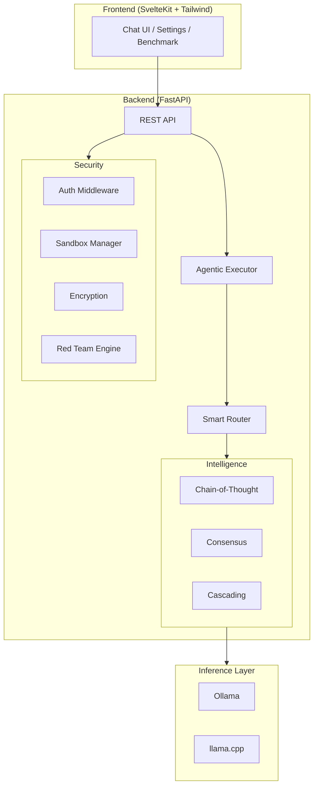

# Opti-Oignon

**Local-first AI inference platform with defense-in-depth security.**

Opti-Oignon sits between you and [Ollama](https://ollama.com) (or llama.cpp),
adding smart routing, multi-model consensus, RAG-powered projects, an
autonomous coding agent, and a layered security architecture -- all running
locally on your hardware.

## Key features

- **Smart routing** -- ML-based model selection with cascading inference and
  speculative generation
- **RAG projects** -- ChromaDB-backed retrieval with prompt injection defense
- **Coding agent** -- sandboxed autonomous code execution with self-correction
- **Plugin ecosystem** -- hook-based architecture with subprocess isolation
- **Security by default** -- six defense layers, 2FA (WebAuthn + TOTP),
  AES-256-GCM encryption, post-quantum signatures, multi-user RBAC
- **Bulbe mode** -- maximum security with localhost-only socket binding
- **Red team engine** -- LLM-powered automated security auditing with
  scheduled runs and regression detection
- **Theme engine** -- user-defined accent colors with WCAG AA contrast
  validation and live preview
- **Keyboard shortcuts** -- 6 default bindings, customizable, cheat sheet overlay
- **Streaming** -- SSE backpressure, connection pooling, chunked RAG transfer
- **CI/CD** -- GitHub Actions pipeline with release signing and Docker support
- **Full CLI** -- `oo` command-line companion for terminal workflows

## Quick start

```bash
# Clone and install
git clone https://github.com/AntsAreRad/opti-oignon.git
cd opti-oignon
pip install -e ".[dev]"

# Start the backend
python -m opti_oignon

# In another terminal, start the frontend
cd frontend && npm install && npm run dev
```

See [Installation](getting-started/installation.md) for detailed instructions.

## Architecture at a glance



## Project status

Opti-Oignon is under active development. Current version: **v3.3.0**.

| Metric | Value |
|--------|-------|
| Backend modules | ~255 |
| Svelte components | ~137 |
| API endpoints | ~519 |
| Tests | 9,000+ |

## License

Opti-Oignon is open source. See the repository for license details.
